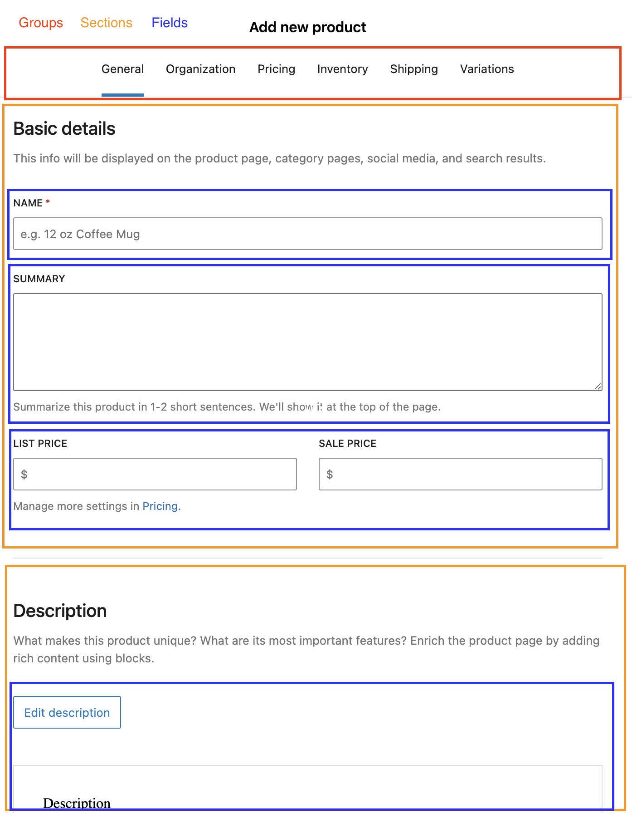

# Developing extensions for the block product editor

> ⚠️ **Notice:** This documentation is currently a **work in progress**. While it's open to the public for transparency and collaboration, please be aware that some sections might be incomplete or subject to change. We appreciate your patience and welcome any contributions!

This handbook is a guide for extension developers looking to add support for the new block product editor in their extensions. The block product editor uses [Gutenberg's Block Editor](https://github.com/WordPress/gutenberg/tree/trunk/packages/block-editor), which is going to help WooCommerce evolve alongside the WordPress ecosystem.

The block product editor's UI consists of Groups (currently rendered as tabs), Sections, and Fields, which are all blocks.

The form's structure is currently stored statically in PHP in a tree structure we call a Template. The way of tapping into the block product editor structure is by consuming the [Template API](php-template-api.md) by attaching your custom code to the correct [hook](hooks.md). This object-oriented API allows extensions to add new Groups, Sections, and Fields to the product editor, as well as modify existing ones. All of the editor's blocks are added through the same API, so by using it, the changes you make will be treated as first-class citizens by the block product editor.

Depending on the complexity of the extension's UI, the implementation might be achieved using only the PHP API. However, if the behavior needed is very specific, a custom block will probably have to be created, using JavaScript and React ([more information](../../packages/js/create-product-editor-block/README.md)).

## Index

- [Template API](php-template-api.md)
- [Hooks](hooks.md)
- [Common tasks](common-tasks.md)
